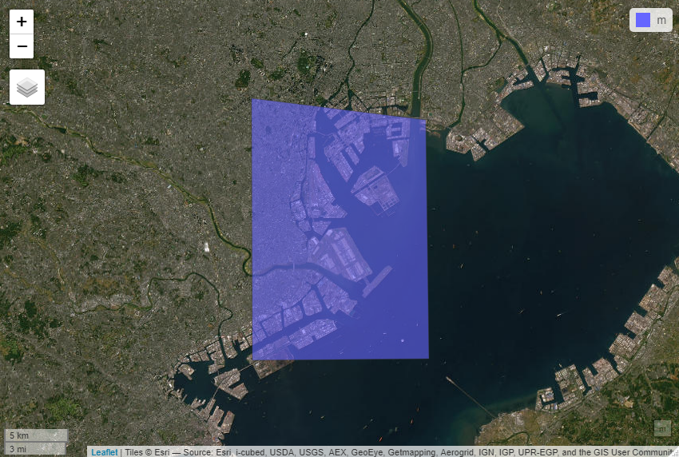

# 分析対象領域（ポリゴン）の作成方法

## インタラクティブに作成

　必要となるパッケージをインストールします。#で始まる行はコメント文です。

```{r, eval = FALSE}
install.packages("mapview")
install.packages("mapedit")
install.packages("sf")
```

　利用するパッケージを呼び出します。

```{r, eval = FALSE}
library(mapview)
library(mapedit)
library(sf)
```

　インタラクティブにベクターデータを作成したい場合にはmapeditパッケージのeditMap()を利用します。editMap()を利用すると、地図が開いて、好きな形のベクタデータを作成することが可能です。

　今回は、東京湾付近のポリゴンデータを作成してみましょう。

```{r, eval = FALSE}
aoi <- editMap()
```

　作成したポリゴンデータに間違いないかをmapviewパッケージを用いて確認しましょう。

```{r, eval = FALSE}
mapview(aoi)
```



　作成したポリゴンデータに間違いないがなければ、geojsonとして保存しましょう。一旦保存してしまえば、いつでも利用することが可能となります。

```{r, eval = FALSE}
st_write(aoi, dsn = "aoi.geojson") # 保存方法
aoi <- st_read("aoi.geojson") # 読込方法
```

## 4隅の緯度経度を基に作成

　インタラクティブに分析対象領域を一から作成する場合にはeditMap()は便利ですが、分析対象領域が既に決まっている場面もあるかと思います。その場合には、4隅の緯度経度が分かれば、簡単にポリゴンデータを作成することが可能です。

　まずは、必要となるパッケージをインストールします。#で始まる行はコメント文です。

```{r, eval = FALSE}
install.packages("mapview")
install.packages("sf")
install.packages("raster")
```

　次に、利用するパッケージを呼び出します。

```{r, eval = FALSE}
library(mapview)
library(sf)
library(raster)
```

　4隅の緯度経度を基にポリゴンデータを作成するコードは、以下となります。

```{r, eval = FALSE}
aoi <- as(extent(139.7045, 139.8573, 35.47745, 35.66065), "SpatialPolygons")
aoi <- st_as_sf(aoi, crs = 4612)
st_crs(aoi) <- "+proj=longlat +ellps=WGS84 +no_defs"
```

　作成したポリゴンデータに間違いないかをmapviewパッケージを用いて確認しましょう。

```{r, eval = FALSE}
mapview(aoi)
```


　先と同様、作成したポリゴンデータに間違いないがなければ、geojsonとして保存しましょう。一旦保存してしまえば、いつでも利用することが可能となります。

```{r, eval = FALSE}
st_write(aoi, dsn = "aoi.geojson") # 保存方法
aoi <- st_read("aoi.geojson") # 読込方法
```
