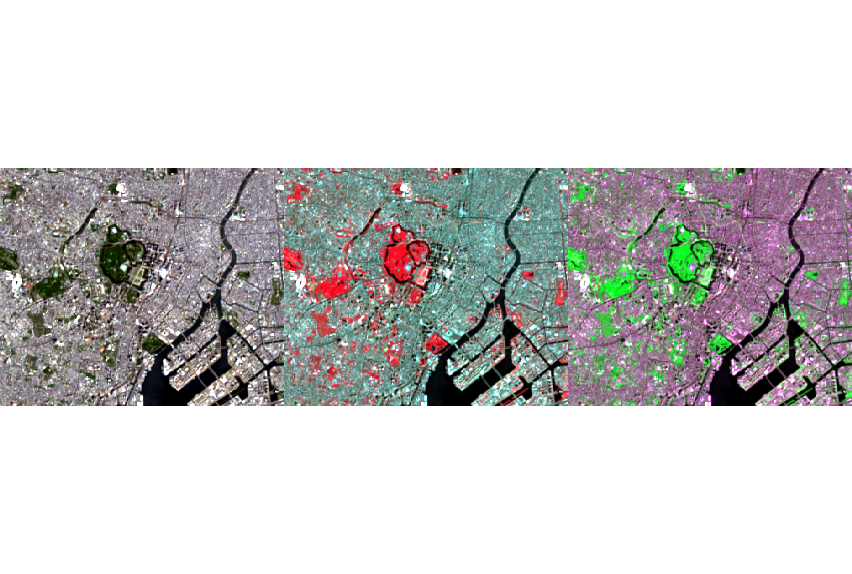

# 衛星データ解析基礎準備

## APIでSentinel-2の画像を取得する①

　必要となるパッケージをインストールします。#で始まる行はコメント文です。

```{r, eval = FALSE}
install.packages("mapview")
install.packages("mapedit")
install.packages("sen2r")
install.packages("sf")
```

## APIでSentinel-2の画像を取得する②

　まず利用するパッケージを呼び出します。

```{r, eval = FALSE}
library(mapview)
library(mapedit)
library(sen2r)
library(sf)
```

　取得したい画像の場所を決定するために、座標情報を得る必要があります。今回はmapeditパッケージのeditMap()を利用して、その座標情報を取得しましょう。

```{r, eval = FALSE}
m <- editMap()
sf::st_write(m, dsn = "m.geojson") # 取得した座標情報をgeojsonとして保存
```

　取得した領域が合っているか、mapviewパッケージを用いて確認しましょう。

```{r, eval = FALSE}
mapview(m)
```


　指定した領域であることを確認できたら、衛星データを取得します。RのSentinel-2のAPIであるsen2rパッケージを利用します。sen2rを利用するには事前の登録が必要となります。まずは、ユーザー情報を入力します。

```{r, eval = FALSE}
username <- "*********"
password <- "*********"
write_scihub_login(username, password)

# APIの規約上、ESA登録後すぐには利用できません（1日～数日後には利用可能）。
```

　衛星データを取得します。「場所」「時間」「データの処理レベル」「被雲率」を指定しています。

```{r, eval = FALSE}
products <- s2_list(spatial_extent = m,
                    time_interval  = as.Date(c("2021-11-10", "2021-11-20")),
                    time_period    = "full",
                    level          = "L2A",
                    max_cloud      = 100)
```

　取得した衛星データ数を確認します。今回の例では、2シーンあることがわかります。

```{r, eval = FALSE}
length(products)
```

　雲がない画像を取得するため、被雲率が低い衛星データの行を確認しましょう。

```{r, eval = FALSE}
products_gdf <- as.data.frame(products)
products_gdf_sorted <- products_gdf[order(products_gdf$clouds, decreasing = FALSE), ]
products_gdf_sorted # 並び替え結果を確認し、取得したい衛星データの行を確認
```

　被雲率が低い衛星データの行を確認できたら、取得したい衛星データをダウンロードしましょう。

```{r, eval = FALSE}
s2_download(products[1], order_lta = TRUE) # s2_listの結果を格納した変数を利用
```

## 対象領域の画像を表示する

　terraパッケージを用いて、取得したSentinel-2のデータを確認します。今回は、Sentinel-2のBand4,3,2を合成したトゥルーカラー画像を作成しましょう。 　まずは、先ほどダウンロードした衛星データのパスを用いてラスターデータとして読み込みます。格納先のパスに適宜変更してください。

```{r, eval = FALSE}
b4 <- rast("..\\S2A_MSIL2A_20211113T012911_N0301_R074_T54SUE_20211113T040103.SAFE\\GRANULE\\L2A_T54SUE_A033390_20211113T012913\\IMG_DATA\\R10m\\T54SUE_20211113T012911_B04_10m.jp2")
b3 <- rast("..\\S2A_MSIL2A_20211113T012911_N0301_R074_T54SUE_20211113T040103.SAFE\\GRANULE\\L2A_T54SUE_A033390_20211113T012913\\IMG_DATA\\R10m\\T54SUE_20211113T012911_B03_10m.jp2")
b2 <- rast("..\\S2A_MSIL2A_20211113T012911_N0301_R074_T54SUE_20211113T040103.SAFE\\GRANULE\\L2A_T54SUE_A033390_20211113T012913\\IMG_DATA\\R10m\\T54SUE_20211113T012911_B02_10m.jp2")
```

　次に、取得した衛星データを一つの変数に統合します。その前に取得した衛星データのnameを変更しておきましょう。　

```{r, eval = FALSE}
#取得した衛星データのnameを変更
names(b4) <- "b4"
names(b3) <- "b3"
names(b2) <- "b2"

# 取得した衛星データを一つの変数に統合
rgb <- c(b4, b3, b2)
```

　取得した衛星データは関心領域以外も含んだ範囲のデータとなっていますので、関心領域のみを切り取る必要があります。その際、取得した衛星データのcrsはEPSG:32654となっていますので、EPSG:4326へと変更しておきます。

```{r, eval = FALSE}
rgb_reproject <- project(rgb, "EPSG:4326") # rgbのcrsを一般的なEPSG:4326へと変更
rgb_crop <- crop(x = rgb_reproject, y = m)
```

　取得した衛星データをヒストグラムで表示してみます。右に裾の長い分布であることが分かります。

```{r, eval = FALSE}
par(mfrow = c(1,3), mar = c(5, 5, 5, 1)) # 複数のヒストグラムの表示、各ヒストグラムの余白設定
hist(rgb_crop[,,1], col = "red", main = "Red")
hist(rgb_crop[,,2], col = "green", main = "Green")
hist(rgb_crop[,,3], col = "blue", main = "Blue")
dev.off() # ヒストグラムの設定を解除
```

　最後に、取得した衛星データをRGBで表示してみましょう。

```{r, eval = FALSE}
plotRGB(rgb_crop, axes = TRUE, stretch = "lin")
```


## STACを利用した衛星データの取得
　
　STACを利用して衛星データを取得できるようになると、同じ手法で異なった衛星データを取得することが可能となり、解析する衛星データとして様々なものを取り扱えるようになります。詳しくは、**「Pythonで学ぶ衛星データ解析基礎」**等をご覧ください。

　まず、STACの利用に必要なrstacパッケージをインストールします。
　
```{r, eval = FALSE}
install.packages("rstac")
```

　rstacパッケージを呼び出します。
　
```{r, eval = FALSE}
library(rstac)
```

　STACにはEarth SearchやPlanetary Computer等のAPIがカタログ化されており、そうしたAPIを利用することで同じ手法で異なった衛星データを取得することが可能となります。
　今回は、Earth SearchのAPIを利用します。

```{r, eval = FALSE}
search <- stac("https://earth-search.aws.element84.com/v0")
```

　指定の条件下でSTAC経由でSentinel-2のデータを取得します。関心領域のデータを取得するにはboundig boxの入力が必要なため、bounding boxを予め確認しておく必要があります。

```{r, eval = FALSE}
m # 関心領域のbounding boxを確認

result <- search %>% 
            stac_search(collections = "sentinel-s2-l2a-cogs",
                        bbox        = c(139.7049, 35.47745, 139.8573, 35.66065),
                        datetime    = "2021-11-10/2021-11-20") %>% 
            post_request() %>% 
            items_filter(`eo:cloud_cover` < 100)
```

　取得した衛星データ数を確認します。今回の例では、先と同様なので2シーンあることがわかります。

```{r, eval = FALSE}
result
```

　取得した衛星データの被雲率を確認します。コードが少し特殊ですが、以下のようになります。
　
```{r, eval = FALSE}
result$features[[1]]$properties$`eo:cloud_cover`
result$features[[2]]$properties$`eo:cloud_cover`
```

　被雲率が低い方のデータを取得します。今回のデータでは被雲率は99％と0.02%でしたので、0.02％のデータを取得できるよう、10％でフィルターをかけました（0.02％のデータを取得できるのであれば何%でも構いません）。
　
```{r, eval = FALSE}
result_designated <- result %>% 
                       items_filter(`eo:cloud_cover` < 10)
```

　被雲率が低いデータを取得できたので、バンド4,3,2をそれぞれダウンロードします。

```{r, eval = FALSE}
download_B04 <- result_designated %>% 
                  assets_download(asset_names = "B04", overwrite = TRUE)

download_B03 <- result_designated %>% 
                  assets_download(asset_names = "B03", overwrite = TRUE)

download_B02 <- result_designated %>% 
                  assets_download(asset_names = "B02", overwrite = TRUE)
```

　ここから先は先と同様の手順でRGB画像を表示します。

```{r, eval = FALSE}
# 取得した衛星データ（バンド2, 3, 4）を読み込み
stac_b04 <- rast("B04.tif")
stac_b03 <- rast("B03.tif")
stac_b02 <- rast("B02.tif")

# 取得した衛星データのnameを変更
names(stac_b4) <- "b4"
names(stac_b3) <- "b3"
names(stac_b2) <- "b2"

# 取得した衛星データを一つの変数に統合
stac_rgb <- c(stac_b04, stac_b03, stac_b02)

# 取得した衛星データを対象地域のみに切り取り
stac_rgb_reproject <- project(stac_rgb, "EPSG:4326")
stac_rgb_crop <- crop(x = stac_rgb_reproject, y = m)

# 取得した衛星データをRGB表示
plotRGB(stac_rgb_crop, axes = TRUE, stretch = "lin")
```　


## Landsat8の表示

　まずは、画像を読み込みます。今回、読み込む画像のファイル名が長く、また、ファイルの種類も同じため、使用予定のファイルを一括で読み込み、その後で、バンドごとにデータを読み込みます。

```{r, eval = FALSE}
images <- list.files("フォルダ名", pattern = ".TIF") # 指定フォルダに存在する".TIF"データを一括読込
b2_image <- rast(images[1])
b3_image <- rast(images[2])
b4_image <- rast(images[3])
```

　読み込んだデータの内容を確認します。まずは、ヒストグラムでデータのばらつきを確認します。

```{r, eval = FALSE}
par(mfrow = c(3,1)) # 複数のヒストグラムの表示、各ヒストグラムの余白設定
hist(b2_image, breaks = 300, main = "BlueBand", xlim = c(1, 65545))
hist(b3_image, breaks = 300, main = "GreenBand", xlim = c(1, 65545))
hist(b4_image, breaks = 300, main = "RedBand", xlim = c(1, 65545))
dev.off() # ヒストグラムの設定を解除
```

　次に、画像を表示します。

```{r, eval = FALSE}
par(mfrow = c(1,3)) # 複数の画像の表示
plot(b2_image, range = c(8000, 15000), col = topo.colors(45), main = "BlueBand", legend = FALSE)
plot(b3_image, range = c(7000, 13000), col = terrain.colors(45), main = "GreenBand", legend = FALSE)
plot(b4_image, range = c(6000, 12000), col = heat.colors(45), main = "RedBand", legend = FALSE)
dev.off() # 画像表示の設定を解除
```


### 4隅の緯度経度に基づくポリゴンの作成

　地図を見ながらのポリゴン作成はeditMap()を活用して行いましたが、今回は4隅の緯度経度からポリゴンを作成します。少しややこしいですが、以下のように作成します。

```{r, eval = FALSE}
aoi <- as(raster::extent(139.7101, 139.7201, 35.6721, 35.6841), "SpatialPolygons")
aoi <- st_as_sf(aoi, crs = 4612)
st_crs(aoi) <- "+proj=longlat +ellps=WGS84 +no_defs"
```
　
　作成できたら、データを確認します。

```{r, eval = FALSE}
mapview(aoi)
```


### バンド4,8の画像を作成したポリゴンで切り取りから表示

　画像の読み込みから、関心領域での切り取り、画像の表示は、上述した通りですので、割愛しますが、コードとしては以下となります。

```{r, eval = FALSE}
# バンド4,8の読み込み
images <- list.files("フォルダ名", pattern = ".TIF")
b4_image <- rast(images[4])
b8_image <- rast(images[5])

# ファイルのnameを変更
names(b4_image) <- "b4"
names(b8_image) <- "b8"

# ファイルの座標変更
b4_image_reproject <- project(b4_image, "EPSG:4326")
b8_image_reproject <- project(b8_image, "EPSG:4326")

# 画像の切り出し
b4_image_crop <- crop(b4_image_reproject, aoi)
b8_image_crop <- crop(b8_image_reproject, aoi)

# 画像の表示
par(mfrow = c(1,2))
plot(b4_image_crop, col = gray.colors(100), legend = FALSE)
plot(b8_image_crop, col = gray.colors(100), legend = FALSE)
dev.off()
```


### カラー合成

　Landsat8のデータを用いてトゥルーカラー、フォルスカラー、ナチュラルカラー画像を表示します。手順は上述した通りですので割愛します。コードは、以下となります。

```{r, eval = FALSE}
# 関心領域の生成
m2 <- editMap()
st_write(m2, "m2.geojson")

# バンド2,3,4,5の読み込み
images <- list.files("フォルダ名", pattern = ".TIF")
b2_image <- rast(images[1])
b3_image <- rast(images[2])
b4_image <- rast(images[3])
b5_image <- rast(images[4])

# ファイルのnameを変更
names(b2_image) <- "b2"
names(b3_image) <- "b3"
names(b4_image) <- "b4"
names(b5_image) <- "b5"

# ファイルの座標変更
b2_image_reproject <- project(b2_image, "EPSG:4326")
b3_image_reproject <- project(b3_image, "EPSG:4326")
b4_image_reproject <- project(b4_image, "EPSG:4326")
b5_image_reproject <- project(b5_image, "EPSG:4326")

# 画像の切り出し
b2_image_crop <- crop(b2_image_reproject, m2)
b3_image_crop <- crop(b3_image_reproject, m2)
b4_image_crop <- crop(b4_image_reproject, m2)
b5_image_crop <- crop(b5_image_reproject, m2)

# 各画像の合成
allImages <- c(b2_image_crop, b3_image_crop, b4_image_crop, b5_image_crop)

# 画像の表示
par(mfrow = c(1,3))
plotRGB(allImages, r = 3, g = 2, b = 1, stretch = "lin") # トゥルーカラー
plotRGB(allImages, r = 4, g = 3, b = 2, stretch = "lin") # フォルスカラー
plotRGB(allImages, r = 3, g = 4, b = 2, stretch = "lin") # ナチュラルカラー
dev.off()
```


### パンシャープン画像の生成

　Landsat8のデータでは、解像度15mのバンド8（パンクロマティック）を活用することで、解像度30mの他のバンドの解像度を15mにまで引き上げることができます。その処理のことを、パンシャープン処理と言います。

　まずは、パンシャープン処理に必要なRStoolboxパッケージをインストールし、読み込みます。

```{r, eval = FALSE}
install.packages("RStoolbox")
library(RStoolbox)
```

　次に、パンシャープン用のバンド8を読み込みます。パンシャープン処理を受ける他のバンドについては先ほど作成した変数allImagesを用います。また、パンシャープン処理を行うには、パンシャープン処理の基になるデータ（ここではバンド8）とパンシャープン処理を受けるデータ（ここではallImages）の情報（crsなど）を同じにする必要がありますので、その加工もしておきます。

```{r, eval = FALSE}
# バンド8の読み込み
b8_image <- rast(images[5])

# ファイルのnameを変更
names(b8_image) <- "b8"

# ファイルの座標変更
b8_image_reproject <- project(b8_image, "EPSG:4326")

# 画像の切り出し
b8_image_crop <- crop(b8_image_reproject, m2)
```

　いよいよ、パンシャープン処理を行います。パンシャープン処理は、RStoolboxパッケージのpanSharpenを用いることでできます。コードとしては次のようになります。
　RStoolbox::panSharpen(パンシャープン処理を受けるデータ, パンシャープン処理の基になるデータ, RGBの設定, パンシャープン処理の方法)

```{r, eval = FALSE}
allImages_pan <- RStoolbox::panSharpen(allImages, b8_image_crop, r = 3, g = 2, b = 1, method = "brovey")
```

　パンシャープン画像を生成できましたので、元画像と比較します。

```{r, eval = FALSE}
par(mfrow = c(1,2))
plotRGB(allImages, r = 3, g = 2, b = 1, stretch = "lin")
plotRGB(allImages_pan, r = 3, g = 2, b = 1, stretch = "lin")
dev.off()
```


