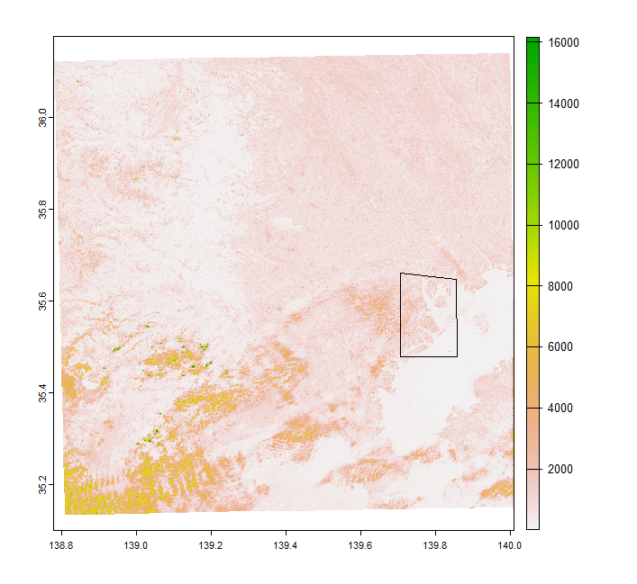
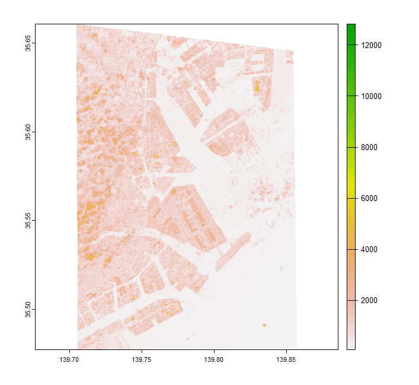
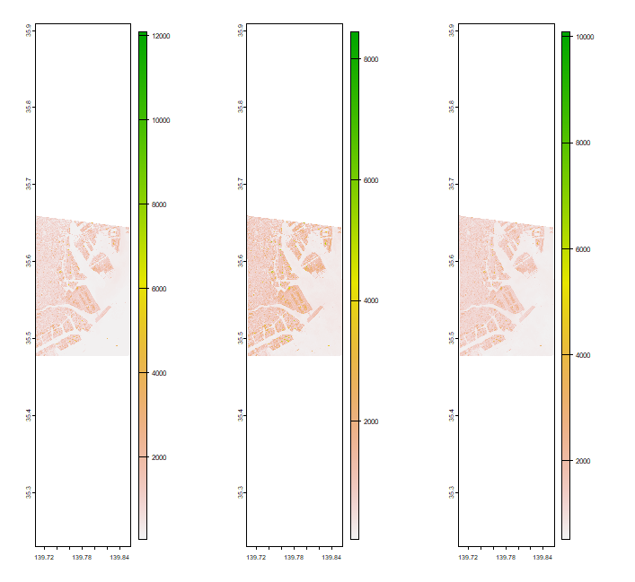
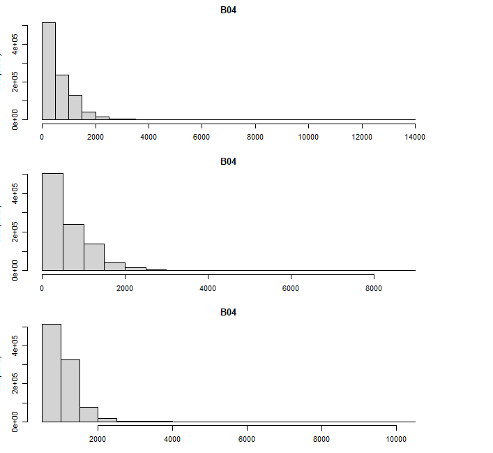

# STAC(AWS)を使用した衛星データの取得

　STACとはSpatio Temporal Asset Catalogsの略で、STAC APIを利用することで様々な衛星データの検索・取得を手軽に行うことが可能となります。STACの詳細な説明は、[こちら](https://stacspec.org/en/)をご覧ください。

## 基本編

　まずは必要となるパッケージをインストールします。#で始まる行はコメント文です。

```{r, eval = FALSE}
install.packages("mapedit")
install.packages("mapview")
install.packages("rstac") # RでSTACを利用するためのパッケージ
install.packages("terra")
install.packages("sf")
```

　利用するパッケージを呼び出します。

```{r, eval = FALSE}
library(mapview)
library(mapedit)
library(rstac)
library(terra)
library(sf)
```

### 分析対象領域の設定・作成

　mapeditパッケージのeditMap()を利用して、分析対象領域のポリゴンデータを作成します。今回は、東京湾付近のポリゴンデータを作成してみましょう。

```{r, eval = FALSE}
aoi <- editMap()
```

　作成したポリゴンデータに間違いないかをmapviewパッケージを用いて確認しましょう。

```{r, eval = FALSE}
mapview(aoi)
```


　作成したポリゴンデータを確認できればgeojsonとして保存しましょう。一旦保存してしまえば、いつでも利用することが可能となります。

```{r, eval = FALSE}
st_write(aoi, dsn = "aoi.geojson") # 保存方法
aoi <- st_read("aoi.geojson") # 読込方法
```

### STAC(AWS)を利用した衛星データの取得

　STAC APIを利用するには、利用するAPIを設定する必要があります。APIには、Microsoft Planetary Computerなどがあります。今回は、Earth SearchのAPIを利用します。

```{r, eval = FALSE}
search <- stac("https://earth-search.aws.element84.com/v0")
```

　指定したAPI経由で衛星データを取得するにはstac_search()を使います。衛星データを取得する際には、取得する衛星データ、分析対象領域（bounding box）、対象期間などを設定します。今回は、分析対象領域を先ほど作成したaoiとし、対象期間を2021年11月10日～11月20日として、衛星データを取得しましょう。

```{r, eval = FALSE}
aoi # 関心領域のbounding boxを確認

result <- search %>% 
            stac_search(collections = "sentinel-s2-l2a-cogs",
                        bbox        = c(139.7049, 35.47745, 139.8573, 35.66065),
                        datetime    = "2021-11-10/2021-11-20") %>% 
            post_request()
```

　これで指定した条件に当てはまるデータが取得できましたので、取得したデータ数を確認しましょう。今回の事例では、1シーンのみと分かります。

```{r, eval = FALSE}
result
```

　ついでに、取得したデータの情報を確認しましょう。STAC経由で入手したデータは複数の入れ子構造で様々な情報が含まれているため、最初は戸惑うかもしれません。また、STAC経由で取得した衛星データを扱うにはSTAC用のコードを使う必要があるため、その点も最初は戸惑う・躓くポイントとなります。

　次のコードで、取得したデータの各種情報を確認することができます。

```{r, eval = FALSE}
sentinel
names(sentinel)

sentinel$features[[1]] # 取得したデータに紐づく情報が確認できる
names(sentinel$features[[1]])

sentinel$features[[1]]$properties # 取得したデータのpropertiesを確認できる
names(sentinel$features[[1]]$properties)

sentinel$features[[1]]$assets # 取得したデータのassetを確認できる
names(sentinel$features[[1]]$assets)
```

### GDALを利用した衛星データの読込と表示

　STAC経由で取得した衛星データの「assets」に紐づくバンド情報にはURL（href）が含まれています。そのURLに対し、GDALのVirtual File Systemsを利用することで、自分のPCに衛星データをダウンロードせずしてデータの読込・演算・表示などの様々な操作が可能となります。

　今回は、GDALのVirtual File Systems（"/vsicurl/"）を利用して、バンド4のデータの読込・表示をします。

```{r, eval = FALSE}
sentinel$features[[1]]$assets$B04$href # バンド4のURLを確認

url <- paste0("/vsicurl/", sentinel$features[[1]]$assets$B04$href)
b04 <- rast(url)
```

　上記で、バンド4のデータを読み込めましたので、データを確認します。
　
```{r, eval = FALSE}
b04
```

　読み込んだデータの情報を確認したところ、座標参照系（crs）がEPSG:32654となっていることが分かりました。editMap()で作成したポリゴンデータの座標参照系はEPSG:4326となるため、読み込んだデータの座標参照系をEPSG:4326へ変更します。
　
```{r, eval = FALSE}
b04_reproject <- b04 %>% project(., "EPSG:4326")
b04_reproject # 変更後のデータを確認
```

　座標参照系を変更したところで、今回のデータをplotしたいと思います。ついでに、分析対象領域のデータとなっているか確認するため、分析対象領域も重ねてplotします。

```{r, eval = FALSE}
plot(b04_reproject)
plot(aoi$geometry, add = TRUE)
```


　両データをplotしたところ、今回取得したデータは分析対象領域以外の領域も含んでいることが分かりました。分析対象領域に絞ったデータが欲しいため、cropとmaskを行います。

```{r, eval = FALSE}
b04_aoi <- b04_reproject %>% 
             crop(., aoi) %>% 
             mask(., aoi)

plot(b04_aoi) # cropとmaskが無事に完了したか確認
```


　無事に、今回の分析対象領域のみのデータが表示されましたので、これで基本編は終了となります。

## 応用編

　次は、応用編を紹介します。基本編と応用編の違いは、基本編ではAPI経由で取得した衛星データの数が1つだけというシンプルなものでしたが、応用編ではそれが2枚以上という少し複雑なものを取り扱います。

　まずはいつも通り、必要となるパッケージをインストールします。

```{r, eval = FALSE}
install.packages("mapview")
install.packages("rstac")
install.packages("terra")
install.packages("tidyverse")
```

　利用するパッケージを呼び出します。

```{r, eval = FALSE}
library(mapview)
library(rstac)
library(terra)
library(tidyverse)
```

### 分析対象領域の設定・作成

　基本編で作成したポリゴンデータをそのまま利用します。念のため、利用するポリゴンデータに間違いないかをmapviewパッケージを用いて確認しましょう。

```{r, eval = FALSE}
mapview(aoi)
```


　STAC経由で衛星データを取得する際にbboxを設定しやすくするために、ポリゴンデータのbboxを別変数に格納しておきます。

```{r, eval = FALSE}
aoi_bbox <- st_bbox(aoi)
```

### STAC(AWS)を利用した衛星データの取得

　まずは、利用するAPIを設定する必要があります。今回も、Earth SearchのAPIを利用します。

```{r, eval = FALSE}
search <- stac("https://earth-search.aws.element84.com/v0")
```

　指定したAPI経由で衛星データを取得するにはstac_search()を使います。衛星データを取得する際には、取得する衛星データ、分析対象領域（bounding box）、対象期間などを設定します。今回は、分析対象領域を先ほど使用したaoiとし、対象期間を2017年1月1日～12月31日として、衛星データを取得しましょう。

```{r, eval = FALSE}
sentinel <- search %>% 
              stac_search(collections = "sentinel-s2-l2a-cogs",
                          bbox        = c(aoi_bbox$xmin, aoi_bbox$ymin, aoi_bbox$xmax, aoi_bbox$ymax),
                          datetime    = "2017-01-01/2017-12-31",
                          limit       = 500) %>% 
              post_request()
```

　これで指定した条件に当てはまるデータが取得できましたので、取得したデータ数を確認しましょう。今回の事例では、38シーンと分かります。

```{r, eval = FALSE}
sentinel
```

### tidyverseを利用した衛星データの操作

　今回、2017年1月1日～12月31日の衛星データを取得したわけですが、38シーンと数が多いため、絞り込みを行いたいと思います。具体的には、各月で最も雲量が少ないデータを抽出します。

　衛星データに紐づく情報のうち日付や雲量率の情報が含まれているのは「properties」となるので、まずは「properties」のみを抽出します。　
　
```{r, eval = FALSE}
sentinel_properties <- sentinel %>% 
                         items_reap(field = c("properties"))
```

　次に、今しがた抽出した情報をtibbleへと変換します。

```{r, eval = FALSE}
df <- bind_rows(sentinel_properties)
df # tibbleに変換できたか確認
```

　各月で最も雲量が少ないデータを抽出するには、（１）各月のデータで並び替えを行い、（２）各月の中で最も雲量が少ないデータを選択する、という手順を踏む必要があります。（１）を行うには月のデータが必要となりますが、現状、dfには日付の列はありますが、月の列はないので、日付の情報から月の情報が入った列から作成する必要があります。日付の情報が入った列は、次のように作成します。

```{r, eval = FALSE}
df$datetime <- as.Date(df$datetime)
df$month <- df$datetime %>% 
              format(., "%m") %>% 
              as.integer()

df$month # 月の情報が入った列が作成できたか確認
```

　月の情報が入った列が作成できたので、その変数を基に月ごとにフィルターをかけ、かつ、雲量で並び替えを行うことで、各月で最も雲量が少ないデータのIDを抽出することができます。ただし、月は1～12あるため、for文での繰り返しコードを作成します。

```{r, eval = FALSE}
minId <- c() # 雲量が少ないデータのIDを格納するための変数を作成

getMinCloudItem <- function(df, m){
  df <- df %>% 
         filter(df$month == m) %>% 
         arrange(`eo:cloud_cover`)
  df <- df[1, "sentinel:product_id"]
  return(df)
}

for (m in 1:12){
  minId <- minId %>% 
             rbind(getMinCloudItem(df, m))
}

minId # 12つのデータのIDが抽出できたかを確認
```

### GDALを利用した衛星データの読込と表示

　基礎編で紹介した通り、GDALのVirtual File Systemsを利用するには、各バンドのURLを取得する必要がありました。各バンドのURLは、「assets」に紐づいていたため、先ほど抽出したデータのIDを活用して最初にSTAC経由で抽出したデータ（sentinel）に対してフィルターを掛け、データの全情報を取得し、そこから「assets」に紐づく各バンドのURLを取得します。全バンドを取り扱うのはコードの数が増えるため、今回はバンド4のみのURLを取得します。

```{r, eval = FALSE}
url <- c() # 各バンドのURLを格納するための変数を作成

for (x in 1:nrow(minId)){
  sentinel_selected <- sentinel %>% 
                         items_filter(`sentinel:product_id` == minId[x,])
  url <- url %>% 
           rbind(paste0("/vsicurl/", sentinel_selected$features[[1]]$assets$B04$href))
}

url # 12つのデータが抽出できたかを確認
```

　これでデータの読込の準備ができましたので、後は基本編と同様にterraパッケージのrast()を使って読込、座標系の変更、表示するだけとなります。

```{r, eval = FALSE}
b04_01 <- rast(url[1,]) # 1月のデータの読込
b04_02 <- rast(url[2,]) # 2月のデータの読込
b04_03 <- rast(url[3,]) # 3月のデータの読込

b04_01_reproject <- b04_01 %>% 
                      project(., "EPSG:4326")
b04_02_reproject <- b04_02 %>% 
                      project(., "EPSG:4326")
b04_03_reproject <- b04_03 %>% 
                      project(., "EPSG:4326")

b04_01_aoi <- b04_01_reproject %>% 
                crop(., aoi) %>% 
                mask(., aoi)
b04_02_aoi <- b04_02_reproject %>% 
                crop(., aoi) %>% 
                mask(., aoi)
b04_03_aoi <- b04_03_reproject %>% 
                crop(., aoi) %>% 
                mask(., aoi)

#切り取った対象地域を確認
par(mfrow = c(1, 3))
plot(b04_01_aoi)
plot(b04_02_aoi)
plot(b04_03_aoi)
dev.off()

#ヒストグラムを確認したい
par(mfrow = c(3, 1))
hist(b04_01_aoi)
hist(b04_02_aoi)
hist(b04_03_aoi)
dev.off()
```




